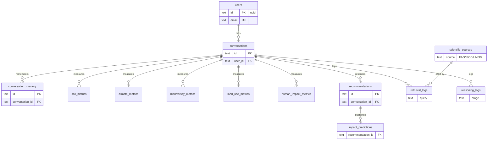

# Entity-Relationship Diagram (13 tables)



**Design decisions (judge-ready answers):**
- One `conversation_id` fans out to all five metric tables → a conversation IS a longitudinal
  landscape record; re-measuring appends rows, never overwrites (audit trail for science).
- `recommendations.dimensions_used` (JSON) makes the ≥3-dimension rule queryable for eval.
- `retrieval_logs` + `reasoning_logs` give full observability: every claim traces to query → docs → chains.
- `scientific_sources.embedding_id` joins the SQL catalog to the vector store for citation-integrity checks.
```
